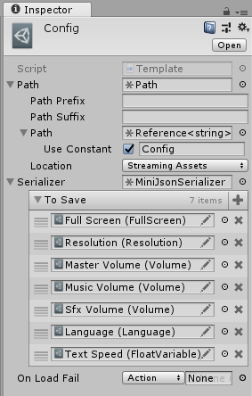

# Muninn

Saving system for my current project. In-editor extendable, singleton-free saving system. Suited for gameplay data, config and multi language support. Based on Ryan Hipple's idea of Scriptable Object variables from Unite Austin 2017. Requires Odin Serializer and Editor.


## Examples

### Config file:


```json
{
  "Full Screen": true,
  "Resolution": "1920 x 1080 @ 75Hz",
  "Master Volume": 0.5,
  "Music Volume": 1,
  "Sfx Volume": 1,
  "Language": "English",
  "Text Speed": 1
}
```

### Nested arrays pretty printing:

```json
{
  "Some dialogue": [    
    ["Obi Wan", "Hello there."], 
    ["Grievous", "General Kenobi. You are a bold one."]
  ]
}
```